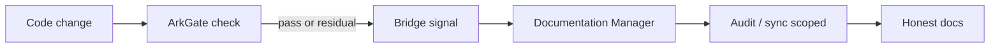

# Feature: ArkGate bridge

> Part of the skill-package knowledge base. Hub: [AGENTS.md](../../../AGENTS.md)  
> Related: [Roadmap](../../roadmap.md) · Plan (shipped): [../../plans/arkgate-bridge/README.md](../../plans/arkgate-bridge/README.md)

**Status:** Shipped (skill procedure; consumer-opt-in)  
**Slug:** `arkgate-bridge`  
**Owners:** skill maintainers  
**Last updated:** 2026-07-15

## Purpose

Close the loop between **ArkGate** (architecture truth in code) and **Documentation Manager** (narrative honesty). After a gate or when Ark is present, agents enrich inventory and run scoped audit/sync — without embedding Ark’s engine.

## Canonical authority

| Topic | Authority (link) | This pack's role |
|-------|------------------|------------------|
| Bridge procedure | [references/arkgate-bridge.md](../../../skills/documentation-manager/references/arkgate-bridge.md) | Entry + summary |
| Mode steps | [modes.md §9](../../../skills/documentation-manager/references/modes.md#9-arkgate-bridge-v14) | Entry |
| Core rules | [SKILL.md](../../../skills/documentation-manager/SKILL.md) rule 17 | Index |
| Quality bar | [quality-checklist.md](../../../skills/documentation-manager/references/quality-checklist.md) ArkGate section | Checklist |

## Users & success

- **Primary users:** agents and devs in repos that use both skills.
- **Success metrics:** post-gate docs pass offered without expert prompt; no-op when Ark absent; residual violations → claim debt not narrative excuses.
- **Out of scope:** rewriting Ark, auto-fixing architecture, SaaS, multi-repo OS.

## Acceptance criteria

- [x] Detection signals documented and agent-usable
- [x] Mode/sub-flow in SKILL + modes + dedicated reference
- [x] Violation/surface → claim/gap mapping without inventing endpoints
- [x] Announce-before-write + non-writes (no ark.config / app source)
- [x] README + AGENTS link the ArkGate pairing
- [x] `./scripts/validate-skill.sh` green

## Public surface

| Kind | Surface | Notes |
|------|---------|-------|
| API / route | — | n/a |
| UI | — | n/a (dashboard is a later epic) |
| CLI / job | — | sensor via existing `ark-check` only |
| Skill procedure | `references/arkgate-bridge.md`, modes §9, SKILL rule 17 | **Real** |
| Package version | skill **1.4.0** | |

## How it works

1. Detect Ark signals (`ark.config.json`, tooling, `.ark/`, ark skills, session).
2. If none → **no-op**.
3. If present on adopt/audit → enrich inventory with layers/globs (no vanity counts in permanent docs).
4. Post-gate: pass → scoped sync/audit; residual → Contradicted/Partial claims.
5. User commits (skill never auto-commits).

### Flow

## Dependencies

- **Depends on:** v1.3 audit/sync modes; optional ArkGate in consumer repo
- **Depended on by:** feature-autopilot-v2 placement hints; knowledge-dashboard links
- **External services:** none

## Design decisions

- Skill-first procedure (no mandatory shell hook in MVP)
- Sensor not fusion — read Ark artifacts only
- Shared **code wins** with Ark (false green / false docs both rejected)

## Edge cases & risks

- Ark skills installed but no `ark.config.json` → soft note, no forced adopt
- Over-coupling to report JSON shape → prefer optional fields; degrade to user paste
- Noise on every commit → offer bridge once per gate session, not spam

## Open questions

- Stable machine-readable `--plan` / JSON schema across Ark versions (consume when stable)
- Optional post-`ark-check` shell hook in a later minor

## Related docs

- Plan: [../../plans/arkgate-bridge/README.md](../../plans/arkgate-bridge/README.md)
- Roadmap: [../../roadmap.md](../../roadmap.md)
