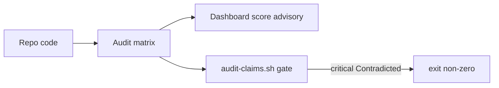

# Feature: Living claims (v0) + CI structural audit

> Part of the skill-package knowledge base. Hub: [AGENTS.md](../../../AGENTS.md)  
> Related: [Roadmap](../../roadmap.md) · Epic: [../../plans/knowledge-os/README.md](../../plans/knowledge-os/README.md) · ADR: [../../adr/0001-living-claims-wire-format.md](../../adr/0001-living-claims-wire-format.md)

**Status:** Shipped  
**Slug:** `living-claims`  
**Owners:** skill maintainers  
**Last updated:** 2026-09-06  
**Package version:** skill **2.5.0**  
**Narrative:** Knowledge OS **first increment toward 100×** (not a second 10×; not a full 100× leap).

## Purpose

Turn documentation claims into **machine-anchored** rows (path / optional symbol / optional hash + severity) so local CI can fail on **critical Contradicted** — without SaaS and without a parallel wiki.

## Canonical authority

| Topic | Authority | Role |
|-------|-----------|------|
| Wire format | [docs/adr/0001-living-claims-wire-format.md](../../adr/0001-living-claims-wire-format.md) | SSOT ADR |
| Procedure | [living-claims.md](../../../skills/documentation-manager/references/living-claims.md) | Skill procedure |
| Matrix template | [audit-template.md](../../../skills/documentation-manager/references/audit-template.md) | Columns |
| Modes | [modes.md §6](../../../skills/documentation-manager/references/modes.md#6-audit-project-or-feature) · [§13](../../../skills/documentation-manager/references/modes.md#13-living-claims--ci-structural-audit-v25) | Wiring |
| Core rule | [SKILL.md](../../../skills/documentation-manager/SKILL.md) rule 25 | Index |
| Local CI gate | `scripts/audit-claims.sh` + `.github/workflows/docs-audit.yml` | Real CLI / example GHA (package scripts slice) |

## Acceptance criteria

- [x] ADR documents id, anchors, severity, unchanged verdicts, truth-score + CI gate  
- [x] Matrix-first template + `references/living-claims.md`  
- [x] SKILL + modes + quality-checklist wired; concept anchors greppable  
- [x] Feature pack promoted  
- [x] Local `audit-claims.sh` + example GHA + fixtures — shipped in 2.5.0; gate is **whole matrix** (not `--list-changed`)  
- [ ] Version/meta sync README/AGENTS/CHANGELOG (release-meta exclusivity — same release)

## Public surface

| Kind | Surface | Notes |
|------|---------|-------|
| ADR | `docs/adr/0001-living-claims-wire-format.md` | **Real** |
| Procedure | `references/living-claims.md` | **Real** |
| Template | `references/audit-template.md` | Extended columns |
| CLI | `scripts/audit-claims.sh` | Air-gapped gate (same cut, scripts slice) |
| CI example | `.github/workflows/docs-audit.yml` | Opt-in copy for consumers |
| Package version | **2.5.0** | |

## How it works

1. Audit writes `docs/audit/claims-matrix.md` with Anchor path / symbol / hash + Severity.  
2. Dashboard may show heuristic truth score (advisory).  
3. `audit-claims.sh` parses the matrix; **critical + Contradicted → non-zero exit**.  
4. Example GHA invokes the local script on the **whole matrix** (no `--list-changed`; no network required). Agent audit reads stay **diff-first** ([modes.md §6.0](../../../skills/documentation-manager/references/modes.md#60-change-set-diff-first)).

## Related docs

- Epic: [knowledge-os](../../plans/knowledge-os/README.md)  
- Prior Bridge: [template-telemetry](../template-telemetry/README.md) · [knowledge-dashboard](../knowledge-dashboard/README.md)  
