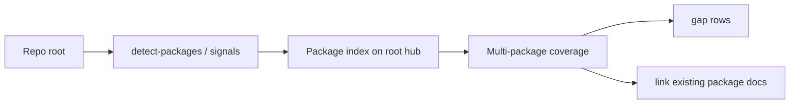

# Feature: Monorepo hubs (package index)

> Part of the skill-package knowledge base. Hub: [AGENTS.md](../../../AGENTS.md)  
> Related: [Roadmap](../../roadmap.md) · Plan: [../../plans/phase-2-bridge/README.md](../../plans/phase-2-bridge/README.md)

**Status:** Shipped  
**Slug:** `monorepo-hubs`  
**Owners:** skill maintainers  
**Last updated:** 2026-07-17  
**Package version:** skill **2.2.0**

## Purpose

Scale Documentation Manager past single-package repos: detect multi-package trees, keep the **root hub as a map**, maintain a **Package index**, mark undocumented packages as **gap**, and never rewrite mature package docs when only indexing the root.

## Canonical authority

| Topic | Authority | Role |
|-------|-----------|------|
| Detection + package index + non-writes | [skill-discovery.md](../../../skills/documentation-manager/references/skill-discovery.md) (Monorepo hubs) | SSOT tables |
| Mode wiring | [modes.md §0.4](../../../skills/documentation-manager/references/modes.md#04-monorepo-hubs-v22-slice-b), §2.1, §2.2b, §6.1, §7.1 | Procedure |
| Core rule | [SKILL.md](../../../skills/documentation-manager/SKILL.md) rule 22 | Index |
| Hub template | [agents-md-template.md](../../../skills/documentation-manager/references/agents-md-template.md) Package index | Consumer shape |
| Detector CLI | [scripts/detect-packages.sh](../../../scripts/detect-packages.sh) | Optional helper |
| Fixtures | `scripts/fixtures/monorepo-thin/` | Hardening |

## Acceptance criteria

- [x] Monorepo detection documented (workspaces / pnpm-workspace / go.work / multi-package)
- [x] Root hub = map + Package index; multi-package coverage with **gap**
- [x] Default package non-writes when indexing root
- [x] monorepo-thin fixture + `detect-packages.sh` asserts
- [x] `./scripts/validate-skill.sh` green

## Public surface

| Kind | Surface | Notes |
|------|---------|-------|
| Skill procedure | skill-discovery Monorepo hubs; modes §0.4 | **Real** |
| CLI | `scripts/detect-packages.sh` | **Real** — package paths per line |
| Fixtures | monorepo-thin | **Real** |
| Package version | **2.2.0** | |

## How it works

1. Detect monorepo signals or run `detect-packages.sh`.  
2. If multi-package: root hub Package index + coverage rows (gap allowed).  
3. Optional package hubs only when in scope.  
4. Do not dump every package narrative into root; do not invent product vision for gaps.

## Related docs

- Umbrella plan: [phase-2-bridge](../../plans/phase-2-bridge/README.md)  
- Prior: [polyglot-mvp](../polyglot-mvp/README.md)  
- Next: team governance · template telemetry  
