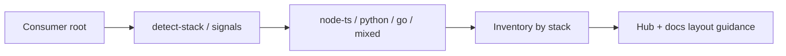

# Feature: Polyglot MVP (stack detection)

> Part of the skill-package knowledge base. Hub: [AGENTS.md](../../../AGENTS.md)  
> Related: [Roadmap](../../roadmap.md) · Plan: [../../plans/phase-2-bridge/README.md](../../plans/phase-2-bridge/README.md)

**Status:** Shipped  
**Slug:** `polyglot-mvp`  
**Owners:** skill maintainers  
**Last updated:** 2026-07-17  
**Package version:** skill **2.1.0**

## Purpose

Stop assuming every consumer repo is Node/TypeScript. Agents detect **python**, **go**, and **node-ts** from filesystem signals, then run inventory and layout guidance from explicit tables — without inventing framework APIs.

## Canonical authority

| Topic | Authority | Role |
|-------|-----------|------|
| Stack signals + inventory + layout tables | [skill-discovery.md](../../../skills/documentation-manager/references/skill-discovery.md) (Polyglot stack detection) | SSOT tables |
| Mode wiring (from-zero / integrate / audit) | [modes.md §0.3](../../../skills/documentation-manager/references/modes.md#03-stack-detection-polyglot-mvp--v21), §2.1, §6.1, §7.1 | Procedure |
| Core rule | [SKILL.md](../../../skills/documentation-manager/SKILL.md) rule 21 | Index |
| Detector CLI | [scripts/detect-stack.sh](../../../scripts/detect-stack.sh) | Optional helper |
| Fixtures | `scripts/fixtures/python-thin-repo/`, `go-thin-repo/` | Hardening |
| Quality bar | [quality-checklist.md](../../../skills/documentation-manager/references/quality-checklist.md) Polyglot section | Checklist |

## Acceptance criteria

- [x] Detection documented for Python + Go + Node/TS baseline
- [x] from-zero / integrate / audit use Inventory by stack + layout guidance
- [x] Non-TS fixtures + `detect-stack.sh` asserts in hardening
- [x] No invented ModuleIds/endpoints without code evidence (rule retained)
- [x] `./scripts/validate-skill.sh` green

## Public surface

| Kind | Surface | Notes |
|------|---------|-------|
| Skill procedure | skill-discovery Polyglot stack detection; modes §0.3 | **Real** |
| CLI | `scripts/detect-stack.sh` | **Real** — prints `node-ts` / `python` / `go` / `unknown` |
| Fixtures | python-thin-repo, go-thin-repo | **Real** |
| Package version | **2.1.0** | |

## How it works

1. On project work, detect stack (`package.json` → node-ts; `pyproject.toml` / requirements → python; `go.mod` / cmd+internal → go).  
2. Optionally run `detect-stack.sh <root>`.  
3. Inventory and feature-slug sources follow the stack tables — shared hub + `docs/` layout for all stacks.  
4. Announce `Stack: …` with Step 0.

## Related docs

- Umbrella plan: [phase-2-bridge](../../plans/phase-2-bridge/README.md)  
- Next slices: monorepo hubs · team governance · template telemetry  
- Parent epic: [knowledge-os](../../plans/knowledge-os/README.md)
