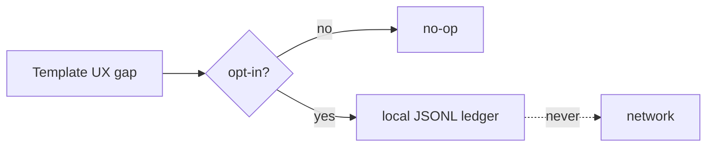

# Feature: Template telemetry

> Part of the skill-package knowledge base. Hub: [AGENTS.md](../../../AGENTS.md)  
> Related: [Roadmap](../../roadmap.md) · Plan: [../../plans/phase-2-bridge/README.md](../../plans/phase-2-bridge/README.md)

**Status:** Shipped  
**Slug:** `template-telemetry`  
**Owners:** skill maintainers  
**Last updated:** 2026-07-17  
**Package version:** skill **2.4.0**

## Purpose

Capture **template / skill UX gaps** in an opt-in **local ledger** so maintainers can improve templates — without network, product code profiling, or secrets.

## Canonical authority

| Topic | Authority | Role |
|-------|-----------|------|
| Privacy + payload contract | [template-telemetry.md](../../../skills/documentation-manager/references/template-telemetry.md) | SSOT |
| Local entry point | [scripts/template-telemetry.sh](../../../scripts/template-telemetry.sh) | Real CLI |
| Modes | [modes.md §12](../../../skills/documentation-manager/references/modes.md#12-template-telemetry-v24-slice-d) | Wiring |
| Core rule | [SKILL.md](../../../skills/documentation-manager/SKILL.md) rule 24 | Index |

## Acceptance criteria

- [x] Payload allowlist + never-send documented  
- [x] Default off; opt-in path; air-gapped no-op  
- [x] Local ledger script (no network tools)  
- [x] Hardening drives on/off + never-send rejections  
- [x] validate green  

## Public surface

| Kind | Surface | Notes |
|------|---------|-------|
| Procedure | `references/template-telemetry.md` | **Real** |
| CLI | `scripts/template-telemetry.sh` | **Real** — status / record |
| Package version | **2.4.0** | |

## How it works

1. Default: do nothing.  
2. User opts in (`DOCS_TELEMETRY_OPT_IN=1`, opt-in file, or `--opt-in`).  
3. `record --gap-kind … --template-id …` appends one JSONL line to a local ledger.  
4. Network never; no source/secrets/repo URLs.

## Related docs

- Umbrella: [phase-2-bridge](../../plans/phase-2-bridge/README.md)  
- Prior: [team-governance](../team-governance/README.md) · [monorepo-hubs](../monorepo-hubs/README.md) · [polyglot-mvp](../polyglot-mvp/README.md)  
- Next horizon: [knowledge-os](../../plans/knowledge-os/README.md) (Fase 3)  
