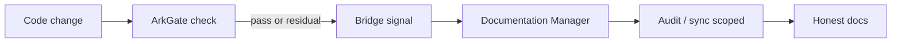

# Plan: ArkGate ↔ Documentation Manager bridge

> **Plan (not SSOT implementation docs).** Hub: [AGENTS.md](../../../AGENTS.md)  
> Related: [Roadmap](../../roadmap.md) · future pack: `docs/features/arkgate-bridge/`  
> When this ships or lands in skill behavior, **promote** to a feature pack (see Promotion).

**Status:** Shipped  
**Slug:** `arkgate-bridge`  
**Kind:** epic  
**Owners:** skill maintainers  
**Last updated:** 2026-07-15  
**Code path:** `skills/documentation-manager/references/arkgate-bridge.md`, `modes.md` §9, `SKILL.md` rule 17 (skill v1.4.0)  
**Feature pack:** [docs/features/arkgate-bridge/README.md](../../features/arkgate-bridge/README.md)

## Problem

ArkGate asegura que el **código** respete la arquitectura. Documentation Manager asegura que la **narrativa** refleje el código. Hoy viven como skills **desconectadas**:

- Tras un gate pass o `/ark-explore`, nadie actualiza docs/audit/plan de forma automática.
- “Code wins” se aplica en ambos mundos, pero **sin contrato compartido** ni trigger común.
- El valor de cada skill se multiplica solo cuando se usan **en pareja**; la fricción de “acordarse de invocar la otra” destruye el 10×.

## Outcome

Después de un cambio de arquitectura o de un gate exitoso, la narrativa del repo (audit matrix, roadmap bullet, feature/plan packs) se **actualiza o se marca drift** sin un prompt experto. Un solo loop mental: *código gobernado → docs honestas*.

## Users & success

- **Primary users:** agentes AI + devs en repos que ya usan (o adoptarán) ArkGate + esta skill.
- **Success metrics:**
  - Post-gate: claims matrix o sync de docs se ofrece/ejecuta sin re-explicar el flujo.
  - Al menos 1 flujo documentado: “gate pass → doc delta” en repo de ejemplo.
  - Cero dependencia de SaaS; todo local/shell/skill.
- **Non-goals / out of scope:**
  - Reescribir ArkGate ni embeber su engine completo aquí.
  - Generar código de producto “mágico” solo desde docs.
  - Forzar ArkGate en repos que no lo usan (bridge **opt-in** por detección).

## MVP scope

| In MVP | Later / out |
|--------|-------------|
| Detectar presencia de ArkGate (`ark.config.json`, skills `/ark-*`) | Deep merge de engines internos |
| Procedimiento skill: post-gate / post-`ark-check` → suggest **audit** o **sync** scoped | Auto-run sin anuncio |
| Contrato de handoff: inventory/violations → filas de claims matrix o gaps | UI compartida obligatoria |
| Doc en README + SKILL: “pair with ArkGate” | Marketplace / SaaS |
| 1 repo dogfood (este u otro open-source) | Polyglot ArkGate variants |

## Acceptance criteria

- [x] Detección de ArkGate documentada y usable por el agente (señales de filesystem + skills).
- [x] Mode o sub-flujo explícito en `SKILL.md` / `modes.md`: **bridge / post-gate sync**.
- [x] Mapeo mínimo: violación o surface nueva → claim o gap en docs (sin inventar endpoints).
- [x] Default **announce-before-write** + non-writes respetados.
- [x] README/AGENTS del skill package enlazan el dúo ArkGate + Documentation Manager.
- [x] `./scripts/validate-skill.sh` sigue verde tras los cambios de skill tree.

## Proposed public surface (hypothesis)

| Kind | Surface | Notes |
|------|---------|-------|
| API / route | — | n/a |
| UI | Opcional: link desde dashboard HTML (otro plan) | TBD |
| CLI / job | Opcional: hook en scripts de usuario post-`ark-check` | TBD; prefer skill procedure primero |
| Events | “gate passed” / “violations residual” como *signals* al agente | No bus de eventos real en MVP |
| ModuleId / package | Skill sections + references | `skills/documentation-manager/` |

*Si no hay código aún, filas TBD — no inventar endpoints.*

## Approach (short)

1. **Sensor, no monorepo fusion:** Documentation Manager lee artefactos/señales de ArkGate; no copia su runtime.
2. **Trigger table:**

| Señal | Acción doc |
|-------|------------|
| Ark presente + user en adopt/audit | Mencionar surfaces Ark en inventory |
| Post gate pass (user o skill ark) | Ofrecer sync/audit de claims tocados |
| Violations residuales | No reescribir architecture para “cuadrar”; marcar **Contradicted** / deuda |

3. Compartir el axioma **code wins** en el handoff (misma taxonomía de veredictos cuando sea posible).
4. Documentar el dúo en packaging (README) para adopción.

## Dependencies & risks

- **Depends on:** estabilidad de signals ArkGate (config paths, skill names); v1.3 modes audit/sync.
- **Blocked by:** nada hard-block; sin ArkGate el bridge es no-op.
- **Risks:** over-coupling a un layout de Ark que cambie; ruido de “sugerir audit” en cada commit.
- **Open decisions:** ¿hook shell opcional vs solo procedimiento en SKILL.md? (prefer skill-first).

## Open questions

- ¿ArkGate expone un plan JSON/`--plan` estable para consumo máquina?
- ¿El bridge vive solo en esta skill, o también un skill “orchestrator” aparte?
- ¿Nombre de mode: `bridge` vs sub-sección de `sync`/`audit`?

## Promotion

When implementation starts or the surface is real in skill/code:

1. Create `docs/features/arkgate-bridge/` from feature template (status from real behavior).
2. Move durable decisions into ADRs if locked.
3. Link this plan from the feature pack (**Related docs**).
4. Mark this plan **Shipped** or **Superseded** and link the feature pack.
5. Update hub nav + roadmap row.

## Related

- Roadmap: [Fase 1 P0](../../roadmap.md#fase-1--10--v20--1-2-meses)
- Epic hermano: [feature-autopilot-v2](../feature-autopilot-v2/README.md)
- Epic hermano: [knowledge-dashboard](../knowledge-dashboard/README.md)
