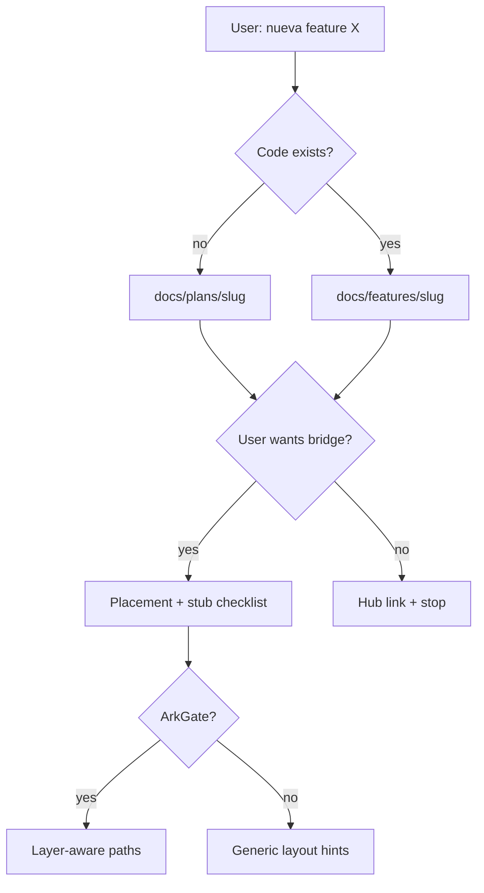

# Plan: Feature autopilot 2.0 + code-generation bridge

> **Plan (not SSOT implementation docs).** Hub: [AGENTS.md](../../../AGENTS.md)  
> Related: [Roadmap](../../roadmap.md) · future pack: `docs/features/feature-autopilot-v2/`  
> When this ships or lands in skill behavior, **promote** to a feature pack (see Promotion).

**Status:** Shipped  
**Slug:** `feature-autopilot-v2`  
**Kind:** epic  
**Owners:** skill maintainers  
**Last updated:** 2026-07-15  
**Code path:** `references/implementation-bridge.md`, `modes.md` §3.1b–3.8, plan/feature templates (skill **v1.5.0**)  
**Feature pack:** [docs/features/feature-autopilot-v2/README.md](../../features/feature-autopilot-v2/README.md)

## Problem

El autopilot v1.3 ya decide **plan vs feature pack** y aplica non-writes. Aún es **básico**:

- No cierra el loop hacia **implementación** (stubs / checklist de código).
- No usa el análisis de capas de ArkGate para proponer *dónde* va el código.
- El usuario sigue cruzando mentalmente “docs listos” vs “empezar a codear”.

Sin v2, el 10× de “costo de docs → 0” se queda a medias: la narrativa nace, el trabajo de ingeniería no se desbloquea.

## Outcome

“Nueva feature X” produce: plan o pack correcto **y** un puente opcional hacia implementación (stubs / placement hints / acceptance checklist) alineado con **code wins** y, si hay ArkGate, con el contrato de capas — sin pretender ser un codegen de producto completo.

## Users & success

- **Primary users:** devs AI-first que piden features en lenguaje natural al agente.
- **Success metrics:**
  - Un prompt plano (“nueva feature X”) → artifacts docs + next steps de código sin menú experto.
  - Stubs/hints solo cuando el usuario o el mode lo piden; default sigue siendo **docs-first / non-writes** de código de producto salvo opt-in.
  - Promote plan → pack documentado y ejercitado en dogfood.
- **Non-goals / out of scope:**
  - Convertir esta skill en un framework full-stack generator.
  - Implementar features de producto ajenas dentro de *este* repo de skill.
  - Auto-commit de stubs.

## MVP scope

| In MVP | Later / out |
|--------|-------------|
| Autopilot decision tree v2 (signals más finos: spike vs epic vs redesign) | Multi-agent swarm |
| Template de “Implementation bridge” (checklist + placement) en plan/feature | Generación masiva de PRs |
| Opt-in: “también generá stubs” con paths hipotéticos marcados TBD | Integración IDE propietaria |
| Hints ArkGate si bridge detectado (capa/dir) | Runtime codegen plugin |
| Promote plan→pack procedure más explícita (comandos/checklist) | Marketplace de feature templates |

## Acceptance criteria

- [x] Decision table v2 documentada en `modes.md` (cuándo plan / feature / hybrid / ask once).
- [x] Sección o template **Implementation bridge** (sin inventar endpoints reales).
- [x] Opt-in claro para stubs; default no escribe código de app sin pedirlo.
- [x] Si ArkGate presente: placement hint usa capas del contrato (vía [arkgate-bridge](../arkgate-bridge/README.md)).
- [x] Quality bar actualizado: anti-alucinación de APIs en el bridge.
- [x] Validate-skill verde.

## Proposed public surface (hypothesis)

| Kind | Surface | Notes |
|------|---------|-------|
| API / route | — | n/a en skill package |
| UI | — | n/a |
| CLI / job | — | n/a |
| Events | Trigger de lenguaje natural “nueva feature / plan feature” | Ya existe v1.3; se refina |
| ModuleId / package | `references/modes.md`, plan/feature templates | |

## Approach (short)

1. **Docs authority first:** v2 no debilita plan-vs-pack ni code wins.
2. **Bridge is optional second stage:** Stage A = docs; Stage B = implementation bridge solo con señal de usuario o flag de mode.
3. **Stubs as hypotheses:** paths y firmas marcadas como propuesta; audit posterior puede contradecirlas.
4. **Compose with Ark place/architect** when available — no reimplementar Ark.

## Dependencies & risks

- **Depends on:** v1.3 autopilot; idealmente [arkgate-bridge](../arkgate-bridge/README.md) para placement rico.
- **Blocked by:** nada para docs-only v2; stubs ricos sí se benefician del bridge.
- **Risks:** agentes que escriben código de más; contaminación de docs con APIs inventadas.
- **Open decisions:** ¿el bridge vive en el plan template o en un archivo hermano `implementation.md`?

## Open questions

- ¿Default “announce stubs” siempre, o solo con “implementá / generá stubs”?
- ¿Cómo marcar en status taxonomy un pack con stubs pero sin Real code?

## Promotion

When implementation starts or the surface is real in skill/code:

1. Create `docs/features/feature-autopilot-v2/` from feature template.
2. Move durable decisions into ADRs if locked.
3. Link this plan from the feature pack.
4. Mark **Shipped** / **Superseded**; update roadmap + hub.

## Related

- Roadmap: [Fase 1](../../roadmap.md#fase-1--10--v20--1-2-meses)
- Depende / enriquece: [arkgate-bridge](../arkgate-bridge/README.md)
- Parcialmente solapa UX: [knowledge-dashboard](../knowledge-dashboard/README.md)
