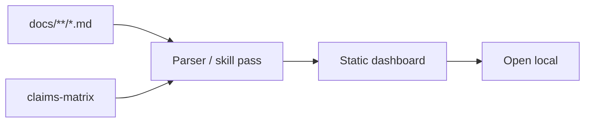

# Plan: Knowledge dashboard (HTML interactivo)

> **Plan (not SSOT implementation docs).** Hub: [AGENTS.md](../../../AGENTS.md)  
> Related: [Roadmap](../../roadmap.md) · future pack: `docs/features/knowledge-dashboard/`  
> When this ships or lands in skill/code, **promote** to a feature pack (see Promotion).

**Status:** Planned  
**Slug:** `knowledge-dashboard`  
**Kind:** new feature  
**Owners:** skill maintainers  
**Last updated:** 2026-07-15  
**Code path (if any):** *none yet* (generación de artefacto estático desde docs; posible script en `scripts/`)

## Problem

Todo el conocimiento vive en **Markdown plano**. En repos grandes:

- Difícil ver el grafo features ↔ plans ↔ audit claims.
- Humanos no “navegan” status/timeline tan bien como un report visual (p.ej. el HTML de ArkGate).
- La skill gana en precisión agent-first pero pierde en **adopción humana** y demos.

## Outcome

Opcionalmente, tras audit/bootstrap/sync, se genera un **HTML estático local** (graph de features, status, audit matrix, timeline) que se puede abrir en el browser — sin SaaS y sin reemplazar el Markdown como SSOT.

## Users & success

- **Primary users:** humans (leads, PMs ligeros, onboarding) + agentes que linkean el report.
- **Success metrics:**
  - Un comando o paso de skill produce `docs/` o `docs/audit/` → HTML usable offline.
  - Markdown sigue siendo canónico; el HTML es **vista**, no segunda verdad.
  - Tiempo a “ver estado del conocimiento del repo” < 1 minuto post-generación.
- **Non-goals / out of scope:**
  - SPA con backend, auth, multi-tenant.
  - Reemplazar Mintlify/Docusaurus del usuario.
  - Edición WYSIWYG de docs desde el dashboard.

## MVP scope

| In MVP | Later / out |
|--------|-------------|
| HTML estático single-file o carpeta pequeña | SaaS control-plane ([knowledge-os](../knowledge-os/README.md)) |
| Secciones: features status, plans, claims matrix summary, links al hub | Search semántico |
| Generación invocable por skill/script | Auto-open siempre (prefer opt-in) |
| Estilo sobrio, legible, dark-friendly opcional | Design system completo |
| Truth score visual si hay matrix | Live watch / websocket |

## Acceptance criteria

- [ ] Generador documentado (script y/o procedimiento skill).
- [ ] Output no se commitea por defecto (gitignore sugerido o path bajo `docs/audit/generated/` configurable).
- [ ] Enlaces relativos a Markdown fuente.
- [ ] Funciona offline (sin CDN obligatorio, o vendor mínimo documentado).
- [ ] No inventa claims: solo lee lo que existe en docs/code inventory del audit.
- [ ] Validate-skill / smoke no se rompen.

## Proposed public surface (hypothesis)

| Kind | Surface | Notes |
|------|---------|-------|
| API / route | — | n/a |
| UI | `docs/audit/dashboard.html` (hipótesis de path) | TBD hasta implementación |
| CLI / job | `scripts/generate-docs-dashboard.sh` o similar | TBD |
| Events | Post-audit / post-roadmap refresh | Opt-in open |
| ModuleId / package | scripts + skill mode note | |

## Approach (short)

1. **Markdown SSOT** → parse headings/tables conocidos (features index, claims matrix).
2. Emitir HTML estático; opcionalmente mermaid pre-render o mermaid.js local.
3. Alineado visualmente de forma ligera con reportes Ark (familiaridad del dúo), sin copiar marca.
4. Skill: tras audit, “¿generar dashboard?” una vez; no spamear.

## Dependencies & risks

- **Depends on:** estructura estable de hub/plans/features/audit templates.
- **Blocked by:** nada para un MVP feo pero útil.
- **Risks:** segunda fuente de verdad si alguien edita solo el HTML; parsers frágiles ante Markdown libre.
- **Open decisions:** ¿generar en sandbox vs root? ¿incluir en package npm o solo script?

## Open questions

- ¿Parser en bash/Python/Node? (preferir zero/low dependency alineado al repo shell-first).
- ¿Commitear el HTML en demos o solo artefactos locales?

## Promotion

When implementation starts or the surface is real:

1. Create `docs/features/knowledge-dashboard/`.
2. ADRs si se fija el path canónico del artefacto.
3. Link plan ↔ pack; mark Shipped; update roadmap + hub.

## Related

- Roadmap: [Fase 1 P1](../../roadmap.md#fase-1--10--v20--1-2-meses)
- Consume salida de audit; se beneficia de [arkgate-bridge](../arkgate-bridge/README.md)
- Evoluciona hacia UI SaaS en [knowledge-os](../knowledge-os/README.md)
