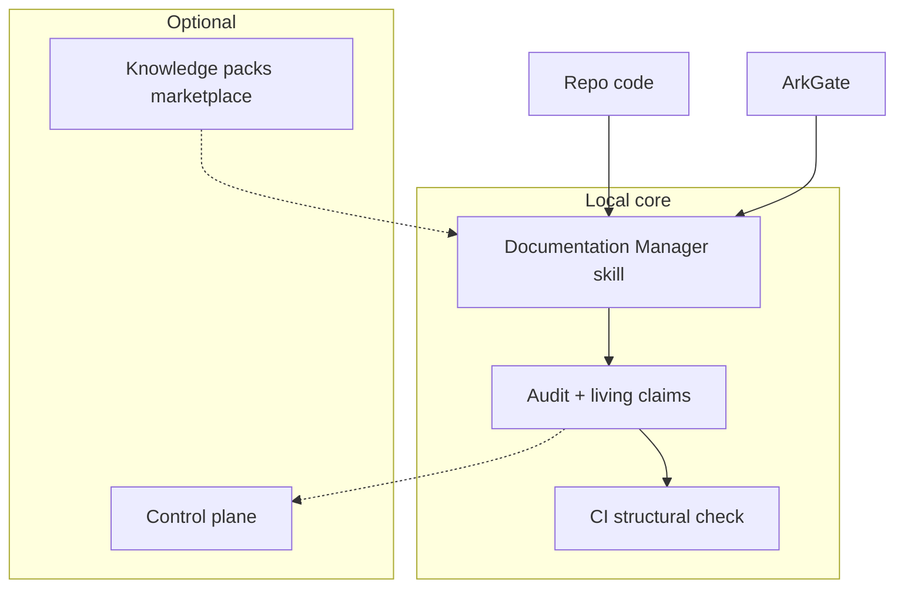

# Plan: Knowledge Operating System (horizonte 100×)

> **Plan (not SSOT implementation docs).** Hub: [AGENTS.md](../../../AGENTS.md)  
> Related: [Roadmap](../../roadmap.md) · future pack: `docs/features/knowledge-os/`  
> When slices ship, **promote** cada slice a feature pack o release notes; este plan permanece como **epic paraguas**.

**Status:** Planned  
**Slug:** `knowledge-os`  
**Kind:** epic  
**Owners:** skill maintainers + partners de ecosistema (futuro)  
**Last updated:** 2026-07-15  
**Code path (if any):** *none yet* — depende de completar 10× ([roadmap Fase 1](../../roadmap.md))

## Problem

Incluso con v2.0 (bridge ArkGate, autopilot, dashboard, hardening), la skill sigue siendo:

- **Un-repo, un host, Markdown-only** en la práctica.
- Sin **claims verificables en CI** a escala.
- Sin **capa org** (políticas, multi-repo, stakeholders).
- Sin camino a convertirse en el **estándar nativo** que todos los agentes cargan por defecto.

El 100× no es “más templates”: es pasar de skill útil a **sistema operativo de conocimiento** AI-native.

## Outcome

Humanos y agentes consultan una **única narrativa verificable** del proyecto (y, en enterprise, de la org): living claims con truth score, polyglot/monorepo, governance, y opcionalmente control-plane SaaS — con core **siempre** usable local y air-gapped.

## Users & success

- **Primary users:** equipos AI-native; orgs que ya usan ArkGate; maintainers de agentes (distribución built-in).
- **Success metrics (largo plazo):**
  - Claims con verificación CI en repos early-adopter.
  - ≥1 lenguaje no-TS con experience de primera clase.
  - Skill o “documentation mode” referenciado como default en ≥1 host mayor **o** MCP registry estable.
  - Marketplace de packs con ≥N presets comunitarios (N a definir en bridge phase).
- **Non-goals / out of scope (permanentes):**
  - Obligar SaaS para el core.
  - Sustituir issue trackers; integrar, no clonar Jira/Linear.
  - Documentación que contradiga código “porque el dashboard lo dice”.

## MVP scope (por tramos)

### Tramo Bridge (post-v2, ≈ 2–4 meses)

| In | Out (queda para 100× full) |
|----|----------------------------|
| Polyglot MVP (Python/Go detection + layouts) | Todos los lenguajes enterprise |
| Monorepo: hub raíz + packages | Federated multi-org graph |
| `docs/team/` governance ligera (owners, approval notes) | Workflow BPM completo |
| Telemetría **opt-in** anónima de gaps de template | Perfilado de código de clientes |

### Tramo Knowledge OS (≈ 4–12 meses)

| In | Más tarde / opcional |
|----|----------------------|
| Living claims: claim ↔ evidencia de código (hash/path) | Proof formal / SMT |
| CI job: audit structural fail on Contradicted critical | Block merge org-wide policies |
| Org-level hub + policy packs | Global public knowledge graph |
| SaaS control-plane **opcional** (search, history, connectors) | Reemplazo de Notion |
| MCP / agent-standard packaging | Negociaciones one-off por host |
| Marketplace knowledge packs | App store con billing complejo día 1 |

## Acceptance criteria (epic-level; slices tendrán los suyos)

- [ ] **Fase Bridge** cerrada según checklist del [roadmap Fase 2](../../roadmap.md#fase-2--bridge--2-4-meses-post-v2).
- [ ] Al menos un pipeline CI de ejemplo (GitHub Actions) que corra audit estructural.
- [ ] Spec de living claims (formato, veredictos, truth score) en ADR + template.
- [ ] Política de privacidad: opt-in, anonymized, air-gapped path documentado.
- [ ] Core local sigue funcionando **sin** cuenta SaaS.
- [ ] Quality bar anti over-documentation intacto.

## Proposed public surface (hypothesis)

| Kind | Surface | Notes |
|------|---------|-------|
| API / route | SaaS API (futuro) | TBD; no en core skill |
| UI | Dashboard local → control-plane web | Extiende [knowledge-dashboard](../knowledge-dashboard/README.md) |
| CLI / job | `docs-audit` CI entrypoint (nombre TBD) | |
| Events | webhooks Linear/Jira (connectors) | Opt-in |
| ModuleId / package | skill + optional services monorepo futuro | No fusionar prematuro con este repo skill-only |

## Approach (short)

1. **No saltar el 10×:** Bridge y OS asumen ArkGate bridge + autopilot v2 + hardening.
2. **Core local forever:** shell/skill/CI scripts; SaaS es capa encima.
3. **Living claims:** cada claim verificable estructuralmente hereda el audit matrix; se añade ancla a path/símbolo y score.
4. **Ecosystem play:** MCP + agent skill registry > reinventar hosts.
5. **Competencia:** vs Notion/Mintlify/Swimm → ganar en code wins + ArkGate + agent-native, no en wiki genérica.

## Dependencies & risks

- **Depends on:** v2.0 10× plans ([arkgate-bridge](../arkgate-bridge/README.md), [feature-autopilot-v2](../feature-autopilot-v2/README.md), [knowledge-dashboard](../knowledge-dashboard/README.md), [skill-hardening](../skill-hardening/README.md)).
- **Blocked by:** adopción real post-v2; sin usuarios el OS es vaporware.
- **Risks:** scope creep SaaS; privacidad; over-documentation; fragmentación polyglot a medias.
- **Open decisions:** ¿monorepo de servicios separado del package skill? ¿marca “Documentation Manager” vs nombre OS?

## Open questions

- ¿Formato wire de living claims (YAML frontmatter vs matrix only vs sidecar JSON)?
- ¿Governance: CODEOWNERS-like para docs o proceso solo en Markdown?
- ¿Quién opera el marketplace (community GitHub vs hosted)?

## Implicaciones y edge cases (del análisis)

| Tema | Postura |
|------|---------|
| Privacidad | Opt-in + anonymized; enterprise air-gapped |
| Over-documentation | Minimal viable narrative + quality bar estricto |
| Costo | Core local/shell; SaaS opcional |
| Competencia | Diferenciador code wins + ArkGate + agentes |

## Promotion

Este epic **no se promueve de un golpe**. Cada slice:

1. Gana su `docs/features/<slice>/` o release en CHANGELOG/README.
2. Actualiza filas del [roadmap](../../roadmap.md).
3. Cuando el OS sea real como producto, este plan pasa a **Superseded** por un feature cluster `knowledge-os` Index.

## Related

- Roadmap: [Fase 2](../../roadmap.md#fase-2--bridge--2-4-meses-post-v2) · [Fase 3](../../roadmap.md#fase-3--100-knowledge-os--4-12-meses)
- Prerrequisitos 10×: [arkgate-bridge](../arkgate-bridge/README.md), [feature-autopilot-v2](../feature-autopilot-v2/README.md), [knowledge-dashboard](../knowledge-dashboard/README.md), [skill-hardening](../skill-hardening/README.md)
