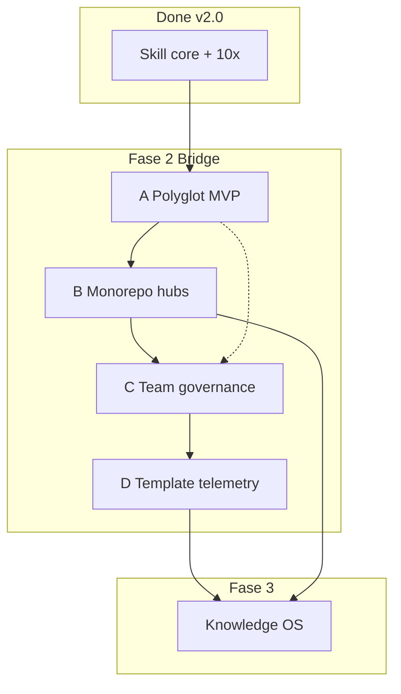

# Plan: Phase 2 — Bridge (polyglot · monorepo · team · telemetry)

> **Plan (not SSOT implementation docs).** Hub: [AGENTS.md](../../../AGENTS.md)  
> Related: [Roadmap](../../roadmap.md) · parent epic: [knowledge-os](../knowledge-os/README.md)  
> When slices ship, **promote** each to `docs/features/<slug>/` or a release note; this plan is the **Fase 2 umbrella**.

**Status:** In progress (Slices A–B **Shipped**)  
**Slug:** `phase-2-bridge`  
**Kind:** epic  
**Owners:** skill maintainers  
**Last updated:** 2026-07-17  
**Code path (if any):** A → polyglot + `detect-stack.sh`; B → monorepo hubs + `detect-packages.sh`, fixture `monorepo-thin`  

**Horizon:** ~2–4 months post-v2.0.0  
**Prerequisite:** [Fase 1 / 10× complete](../../roadmap.md#fase-1--10--v20--complete) (v2.0.0)

## Problem

Con **v2.0.0** la skill es sólida en el nicho *un repo, layout JS/TS AI-first, un maintainer o un agente solo*:

| Limitación hoy | Efecto |
|----------------|--------|
| Layouts y señales de stack sesgados a Node/TS | Python/Go (y otros) caen en defaults genéricos o inventados |
| Un hub + un `docs/` asume monorepo simple o single-package | Packages huérfanos; agents pierden el mapa del monorepo |
| No hay governance de equipo en la KB | Dueños, review y “quién aprueba claims” viven fuera del repo o en chat |
| Mejora de templates es manual / anecdótica | Gaps de templates se repiten en cada adopt sin señal estructurada |

Sin Bridge, el **Knowledge OS (Fase 3)** no tiene base: living claims, org hub y CI audit asumen multi-package, multi-stack y ownership claros.

## Outcome

Documentation Manager sale del nicho TS-single-repo y se comporta bien en:

1. **Repos** con al menos **Python y Go** de primera clase (detección + layouts + templates).  
2. **Monorepos** con hub raíz + hubs/índice por package.  
3. **Equipos** con governance ligera en `docs/team/` (owners, approval notes).  
4. **Mejora continua** vía telemetría **opt-in** anónima de gaps de templates (air-gapped path intacto).

Resultado: listo para equipos y monorepos, sin SaaS, sin debilitar **code wins**.

## Users & success

- **Primary users:** equipos AI-native en monorepos; maintainers polyglot; agentes que corren adopt/audit en repos no-TS.
- **Success metrics (Fase 2):**
  - Dogfood: ≥1 repo Python **y** ≥1 repo Go (o monorepo mixto) con integrate/from-zero usable sin hacks ad-hoc.
  - Monorepo: hub raíz lista packages + link a docs por package; agent no escribe un único monólito falso.
  - Team: al menos un flujo documentado “owner + approval note” en `docs/team/`.
  - Telemetría: path opt-in documentado; default = off; zero network en air-gapped.
  - `./scripts/validate-skill.sh` (y hardening) verdes tras cada slice.
- **Non-goals / out of scope (Fase 2):**
  - Living claims + truth score, CI gate de merge, SaaS, MCP registry, marketplace (→ [knowledge-os](../knowledge-os/README.md) Fase 3).
  - Todos los lenguajes enterprise (solo MVP polyglot).
  - Workflow BPM / tickets como sistema de approvals.
  - Perfilado de código de clientes o telemetría on-by-default.
  - Federated multi-org graph.

## MVP scope (Fase 2 completa)

| In Fase 2 | Later (Fase 3 / 100×) |
|-----------|------------------------|
| Polyglot MVP: Python + Go detection + layout tables | Rust, Java, .NET, … first-class |
| Stack hints en discovery / skill-discovery + modes | Generadores de código por lenguaje |
| Monorepo: root hub + package index + optional package hubs | Org-level multi-repo policy graph |
| `docs/team/` template + procedure (owners, approval notes) | BPM, mandatory multi-stage approvals |
| Telemetría opt-in anónima de *template gaps* only | Product analytics / code fingerprinting |
| Fixtures + golden anchors por slice | Full CI living-claims product |

## Slices (orden de entrega recomendado)

Orden pensado por **dependencia y riesgo**, no por glamour. Cada slice puede shippear como **minor** del package skill (hipótesis: v2.1 → v2.4).

### Slice A — Polyglot MVP (`polyglot-mvp`) · P0 · **Shipped** (v2.1.0)

| | |
|--|--|
| **Problema** | Detection y templates asumen Node/TS. |
| **Entrega** | Señales de stack (manifests, tree); layout table Python + Go; integrate/from-zero/audit respetan layout; docs en `skill-discovery` / modes. |
| **Acceptance** | Ver § Acceptance → A (done). |
| **Feature pack** | [docs/features/polyglot-mvp/](../../features/polyglot-mvp/README.md) |

**Señales mínimas de detección (hipótesis — validar en implementación):**

| Stack | Señales (ejemplos) |
|-------|-------------------|
| Python | `pyproject.toml`, `setup.py`, `requirements.txt`, `src/` + package |
| Go | `go.mod`, `cmd/`, `internal/` |
| Node/TS (ya) | `package.json`, `tsconfig`, monorepo workspaces |

### Slice B — Monorepo hubs (`monorepo-hubs`) · P0 · **Shipped** (v2.2.0)

| | |
|--|--|
| **Problema** | Un solo hub no escala a packages. |
| **Entrega** | Detección de monorepo (workspaces, `go.work`, multi-`pyproject`, `packages/*`); **root hub** con índice de packages; opcional hub/docs por package; coverage matrix multi-package. |
| **Acceptance** | Ver § Acceptance → B (done). |
| **Feature pack** | [docs/features/monorepo-hubs/](../../features/monorepo-hubs/README.md) |

**Reglas de diseño (locked for this plan):**

1. **Root = mapa**, no dump de toda la narrativa de cada package.  
2. **One authority per topic** se mantiene: claims de un package viven en su árbol o se linkean; no duplicar SSOT.  
3. Packages sin docs → fila **gap** en coverage, no inventar product vision.

### Slice C — Team governance (`team-governance`) · P1

| | |
|--|--|
| **Problema** | Sin dueños ni rastro de aprobación en la KB. |
| **Entrega** | Layout `docs/team/` (o equivalente documentado); template owners + approval notes; procedure en modes; integrate no reescribe product vision al añadir team. |
| **Acceptance** | Ver § Acceptance → C. |
| **Depends on** | Independiente de A/B en gran parte; shippea mejor **después** de monorepo para owners por package. |
| **Promote to** | `docs/features/team-governance/` |

**In scope:** Markdown owners list, “last approved” notes, link desde hub.  
**Out:** CODEOWNERS enforcement engine, bots de merge, roles IAM.

### Slice D — Opt-in template telemetry (`template-telemetry`) · P1

| | |
|--|--|
| **Problema** | Gaps de templates se descubren tarde y a mano. |
| **Entrega** | Contrato de evento anónimo (qué se envía / qué **nunca**); opt-in explícito; path air-gapped = no-op; doc de privacidad en package; script o procedure de export local opcional. |
| **Acceptance** | Ver § Acceptance → D. |
| **Depends on** | Mejor después de A–C (más templates/layouts que medir). Puede shippear un **local ledger** primero y red después. |
| **Promote to** | `docs/features/template-telemetry/` |

**Privacy hard rules (non-negotiable):**

- Default **off**.  
- No source code, no secrets, no repo URLs identificables en payload mínimo (o hash salting documentado si se necesita correlación).  
- Enterprise / air-gapped: documentado y testeable sin red.

## Acceptance criteria

### Epic-level (cierra Fase 2)

- [ ] Slices **A–D** shipped (feature packs o CHANGELOG minors) con validate + hardening verdes.
- [ ] Roadmap Fase 2 marcado **COMPLETE** y release note de cierre Bridge (versión package a definir, p.ej. **2.x** rollup).
- [ ] [knowledge-os](../knowledge-os/README.md) actualiza el tramo Bridge a **done** y desbloquea foco Fase 3.
- [ ] Adoption matrix: ≥1 fila **Verified** polyglot o monorepo (honest; no inventar installs).
- [ ] Core local sigue funcionando **sin** red y **sin** cuenta.
- [ ] Quality bar anti over-documentation intacto (no explosion de templates basura).

### A — Polyglot MVP

- [x] Detección documentada Python + Go (+ Node/TS baseline) en skill references.
- [x] from-zero / integrate eligen layout según stack detectado (tabla explícita en modes o skill-discovery).
- [x] Fixture(s) de hardening para al menos un layout no-TS (thin/mature smoke).
- [x] No se inventan ModuleIds/endpoints de frameworks ajenos sin evidencia de código.

### B — Monorepo hubs

- [x] Detección de monorepo documentada (señales por ecosistema).
- [x] Procedimiento: root hub + package index; optional package-level hub/docs.
- [x] Coverage matrix soporta filas multi-package.
- [x] Default non-writes: no reescribir docs maduras de un package al indexar el root.

### C — Team governance

- [ ] Template `docs/team/` (owners + approval notes) en references.
- [ ] Mode/procedure: cuándo crear vs linkear; integrate-first.
- [ ] Hub del consumer puede linkear Team sin volverse un wiki de RR.HH.

### D — Template telemetry

- [ ] Spec de payload + privacy en package docs.
- [ ] Opt-in mechanism documented; default off verificado en smoke.
- [ ] Air-gapped path: skill usable sin telemetría.
- [ ] Solo gaps de *templates/skill UX*, no profiling de código de producto.

## Proposed public surface (hypothesis)

| Kind | Surface | Notes |
|------|---------|-------|
| API / route | — | No SaaS en Fase 2 |
| UI | Dashboard HTML puede listar packages / team links | Extiende knowledge-dashboard **si** aporta; no bloqueante |
| CLI / job | Opcional: export local de gaps; telemetría opt-in | Prefer skill procedure first |
| Events | “stack detected”, “monorepo packages”, “template gap” | Agent-visible announce, no bus real |
| ModuleId / package | `skills/documentation-manager/` references + templates | Este repo skill-only |
| Docs layout (consumer) | `docs/team/`, multi-hub monorepo | Solo en target projects |

*No inventar endpoints ni servicios; filas TBD hasta que el slice tenga código/scripts reales.*

## Approach (short)

1. **Plan first, then slices** — this document is the gate; no skill-tree coding until a slice is explicitly started.  
2. **Skill-first** — procedures + templates + fixtures before optional scripts.  
3. **Detect, don’t assume** — stack/monorepo signals from filesystem; ask once only when ambiguous.  
4. **Root map / package authority** — monorepo indexing never duplicates SSOT.  
5. **Privacy by construction** for D; ship local ledger before any network.  
6. **Compose with v2** — ArkGate bridge, autopilot, audit, dashboard stay; Bridge extends them, no rewrite.  
7. **Promote per slice** — not one big bang; umbrella plan stays until epic-level AC pass.

**Suggested release train (hypothesis):**

| Order | Slice | Hypothesized package version |
|-------|-------|------------------------------|
| 1 | A Polyglot | 2.1.0 |
| 2 | B Monorepo | 2.2.0 |
| 3 | C Team | 2.3.0 |
| 4 | D Telemetry | 2.4.0 |
| 5 | Bridge rollup note | 2.5.0 or tag “bridge-complete” |

Versions are **not** locked; adjust at ship time.

## Dependencies & risks

- **Depends on:** v2.0.0 shipped (ArkGate bridge, autopilot v2, dashboard, hardening, adoption matrix).  
- **Blocked by:** nothing hard for A/B docs procedures; D blocked by clear privacy decision (see open questions).  
- **Risks:**
  - Polyglot a medias (solo renombrar carpetas sin fixtures) → mitiga con golden tests.  
  - Monorepo over-documentation (un hub gigante) → root map only + quality bar.  
  - Team mode se vuelve wiki de proceso → minimal templates.  
  - Telemetría percibida como spyware → default off + public payload schema.  
  - Scope creep hacia Fase 3 (CI living claims, SaaS) → explicit non-goals.  
- **Open decisions:** (promote to ADR when locked)
  - ¿Package hubs viven en `packages/foo/AGENTS.md` vs `docs/packages/foo/`?
  - ¿Telemetría: solo archivo local en v1 del slice, red en v2 del slice?
  - ¿Owners en `docs/team/OWNERS.md` vs frontmatter por feature?

## Open questions

- ¿Python layout canónico: `src/` vs flat package — soportar ambos con preferencia documentada?
- ¿Go: un módulo vs multi-module `go.work` en monorepo detection v1?
- ¿Team approval notes son append-only log o last-write-wins?
- ¿Quién opera el endpoint de telemetría si hay red (personal maintainer vs futuro SaaS)? → prefer **local-first** hasta Fase 3.
- ¿Cuándo se considera “Fase 2 complete” si D se demora por privacy — ¿A+B+C bastan para un soft-close?

## Implementation bridge

> Slices A–B **shipped**. Say **start slice C** (or D) for the next placement checklist.

**Stubs written:** no (skill/docs/scripts only)

### Slice A placement (done)

| Area | Path | Status |
|------|------|--------|
| Stack tables | `references/skill-discovery.md` | Real |
| Modes | `references/modes.md` §0.3, §2.1, §6.1, §7.1 | Real |
| Detector | `scripts/detect-stack.sh` | Real |
| Fixtures | `scripts/fixtures/python-thin-repo`, `go-thin-repo` | Real |
| Feature pack | `docs/features/polyglot-mvp/` | Real |

### Slice B placement (done)

| Area | Path | Status |
|------|------|--------|
| Monorepo tables | `references/skill-discovery.md` Monorepo hubs | Real |
| Modes | `references/modes.md` §0.4, §2.1, §2.2b, §6.1, §7.1 | Real |
| Detector | `scripts/detect-packages.sh` | Real |
| Hub template | `agents-md-template.md` Package index | Real |
| Fixture | `scripts/fixtures/monorepo-thin/` | Real |
| Feature pack | `docs/features/monorepo-hubs/` | Real |

## Promotion

Este epic **no se promueve de un golpe**. Cada slice:

1. Implementa comportamiento en `skills/documentation-manager/` (+ scripts/tests si aplica).  
2. Crea `docs/features/<slice-slug>/` cuando el comportamiento sea real.  
3. Marca acceptance del slice; actualiza [roadmap](../../roadmap.md) y fila en este plan.  
4. Cuando A–D cierren epic AC → este plan **Shipped** (o **Superseded** por un cluster `bridge/`) y knowledge-os tramo Bridge = done.

## Related

- Roadmap: [Fase 2 — Bridge](../../roadmap.md#fase-2-bridge)  
- Parent / next: [knowledge-os](../knowledge-os/README.md) (Fase 3)  
- Prereqs 10×: [arkgate-bridge](../arkgate-bridge/README.md) · [feature-autopilot-v2](../feature-autopilot-v2/README.md) · [knowledge-dashboard](../knowledge-dashboard/README.md) · [skill-hardening](../skill-hardening/README.md)  
- Adoption: [adoption-matrix.md](../../adoption-matrix.md)
