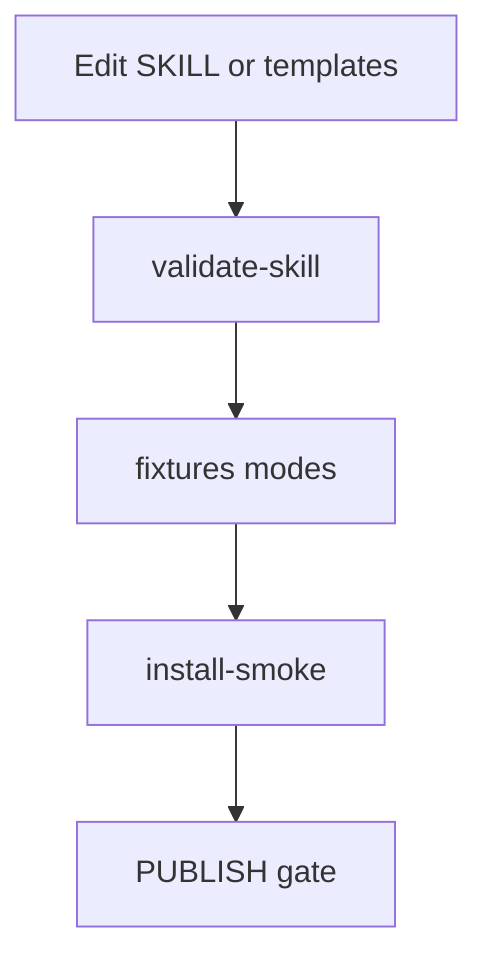

# Plan: Skill hardening (discovery, tests, install)

> **Plan (not SSOT implementation docs).** Hub: [AGENTS.md](../../../AGENTS.md)  
> Related: [Roadmap](../../roadmap.md) · future pack: `docs/features/skill-hardening/`  
> When this ships or lands in skill/code, **promote** to a feature pack (see Promotion).

**Status:** Shipped  
**Slug:** `skill-hardening`  
**Kind:** epic  
**Owners:** skill maintainers  
**Last updated:** 2026-07-15  
**Code path:** `scripts/test-skill-hardening.sh`, `scripts/fixtures/`, `references/skill-discovery.md` (skill **v1.7.0**)  
**Feature pack:** [docs/features/skill-hardening/README.md](../../features/skill-hardening/README.md)

## Problem

La skill es **declarativa y de alta calidad**, pero early-stage:

- Lógica compleja vive en Markdown (`SKILL.md`) → difícil de regresar al refactorizar.
- Solo validación estructural + smoke de install; **no hay tests de modes** (plan vs feature, integrate non-writes, audit verdicts).
- Zero-friction install / auto-discovery aún no existe: el usuario debe saber que la skill existe y actualizarla a mano.
- Sin hardening, el 10× (autopilot, bridge, dashboard) es frágil: cada mejora arriesga regresiones silenciosas.

## Outcome

Confianza de ingeniería para evolucionar a v2.0: suite de regresión, install/discovery predecible, y señal clara de “skill sana” en CI local y del package.

## Users & success

- **Primary users:** maintainers de esta skill; indirectamente todos los consumidores (menos roturas).
- **Success metrics:**
  - `validate-skill.sh` (o sucesor) cubre fixtures de modes, no solo presencia de archivos.
  - Un cambio que rompa “default non-writes en plan mode” falla el suite.
  - Install idempotente + path de upgrade documentado y smoke-testeado.
- **Non-goals / out of scope:**
  - Framework de tests de LLM en la nube de pago.
  - Telemetría de usuarios finales (eso es horizonte 100×, opt-in).
  - Reescribir toda la skill en TypeScript “porque sí”.

## MVP scope

| In MVP | Later / out |
|--------|-------------|
| Fixtures de repo mínimo (thin / mature / no-docs) | Fuzz LLM multi-proveedor continuo |
| Checks: paths de templates, anchors, version sync README↔SKILL | Auto-update daemon global |
| Casos de decisión autopilot (tabla golden: input signals → mode esperado) | Browser e2e de dashboard |
| `install-smoke` en más hosts documentados | Polyglot installers |
| Auto-discovery *documentado* (cómo el agente detecta skill instalada / desactualizada) | Patch automático sin consentimiento |
| Detección de lenguaje/framework → layout recomendado (doc + hints) | Config magic silenciosa |

## Acceptance criteria

- [x] Suite ejecutable en CI local: `./scripts/validate-skill.sh` exit 0 en main limpio.
- [x] Al menos 3 fixtures de proyecto sintético bajo `scripts/fixtures/` (o similar).
- [x] Golden cases para: plan mode, feature mode, integrate non-writes, from-zero sandbox banner.
- [x] Versión única de verdad alineada (metadata SKILL, README badge, AGENTS).
- [x] Documento de upgrade: re-run install / `npx skills add` re-install.
- [x] PUBLISH.md menciona gate de validate antes de release.

## Proposed public surface (hypothesis)

| Kind | Surface | Notes |
|------|---------|-------|
| API / route | — | n/a |
| UI | — | n/a |
| CLI / job | `scripts/validate-skill.sh`, `scripts/install-smoke.sh` | Extender |
| Events | Pre-publish checklist | |
| ModuleId / package | `scripts/`, `install.sh` | |

## Approach (short)

1. **Tratar SKILL.md como código:** contracts testeables (presencia de sections, tablas de modes, links rotos).
2. **Fixtures > mocks de LLM:** validar estructura de *salida esperada* cuando un agente bien instruido sigue el skill (checklists + paths), no flakiness de modelo en MVP.
3. **Discovery:** procedimiento en skill + README: “si version local < package, reinstall”; detección de stack como *hints* en adopt/from-zero.
4. Mantener **shell-first** y dependencias mínimas.

## Dependencies & risks

- **Depends on:** layout actual del package; disciplina de no saltarse validate.
- **Blocked by:** nada.
- **Risks:** over-engineering de un test harness más grande que la skill; golden cases demasiado rígidos ante mejoras de prose.
- **Open decisions:** ¿assert solo estructura o también snapshots de Markdown generado por un runner headless?

## Open questions

- ¿Dónde viven los fixtures (in-repo vs temp dirs del smoke)?
- ¿Versionado semver: minor por modes nuevos, major por breaking de layout docs?

## Promotion

When implementation starts or the surface is real:

1. Create `docs/features/skill-hardening/` if el comportamiento es user-visible durable.
2. ADRs para convenciones de test/fixtures si se estabilizan.
3. Mark plan Shipped; update roadmap + hub.

## Related

- Roadmap: [Fase 1 semanas 5–6](../../roadmap.md#fase-1--10--v20--1-2-meses)
- Habilita con seguridad: [feature-autopilot-v2](../feature-autopilot-v2/README.md), [arkgate-bridge](../arkgate-bridge/README.md)
- Scripts actuales: [scripts/](../../../scripts/)
