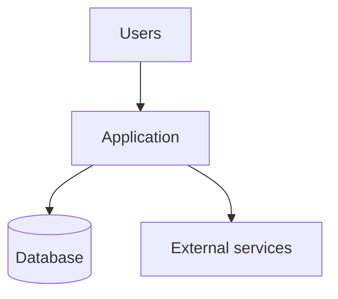

# Architecture

> Hub: [AGENTS.md](../AGENTS.md) · Decisions: [docs/decisions/](./decisions/) · Features: [docs/features/](./features/)

**Last updated:** YYYY-MM-DD

## Overview

[2–4 sentences: system shape, primary runtime, major quality goals.]

## Context diagram

## Components

| Component | Responsibility | Key paths |
|-----------|----------------|-----------|
| … | … | `src/…` |

## Key patterns

- [e.g. layered architecture, CQRS, event-driven — only what is real]

## Technology choices

| Layer | Choice | Why (or ADR link) |
|-------|--------|-------------------|
| Language/runtime | | |
| Framework | | |
| Data store | | |
| Auth | | |
| Deploy | | |

## Data & boundaries

[High-level data ownership, trust boundaries, multi-tenant notes if any.]

## Cross-cutting concerns

- AuthN/AuthZ: …
- Observability: …
- Error handling: …
- Config / feature flags: …

## Feature map

| Feature | Doc | Notes |
|---------|-----|-------|
| … | [features/…/README.md](./features/…/README.md) | |

## Non-goals / deferred

- …

## Related

- Requirements: [requirements.md](./requirements.md)
- Roadmap: [roadmap.md](./roadmap.md)
- ADRs: [decisions/](./decisions/)
