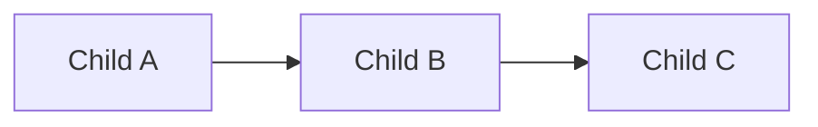

# Feature cluster: [Domain name]

> Hub: [AGENTS.md](../../../AGENTS.md) · Architecture: [architecture.md](../../architecture.md)  
> This file is an **index only** — not a substitute for child feature packs.

**Status:** Index  
**Slug:** `cluster-slug`  
**Owners:** [teams / roles spanning children]  
**Last updated:** YYYY-MM-DD

## Purpose

[One paragraph: why these surfaces are grouped for navigation.]

## Child features

| Feature | Slug | Status | Doc |
|---------|------|--------|-----|
| [Name] | `child-a` | Real \| Dual \| … | [features/child-a](../child-a/README.md) |
| [Name] | `child-b` | … | [features/child-b](../child-b/README.md) |

## Handoffs

## Canonical authorities (cluster-level)

| Topic | Authority |
|-------|-----------|
| … | link |

## Open questions (cross-cutting)

- …

## Related

- Hub coverage matrix rows for all children
- Roadmap epics that span the cluster
