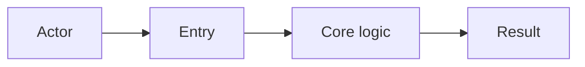

# Feature: [Name]

> Part of the project knowledge base. Hub: [AGENTS.md](../../../AGENTS.md)  
> Related: [Architecture](../../architecture.md) · [Roadmap](../../roadmap.md) · [Decisions](../../decisions/)

**Status:** Planned | In progress | Shipped | Deprecated  
**Slug:** `feature-slug`  
**Owners:** [team or roles]  
**Last updated:** YYYY-MM-DD

## Purpose

[One paragraph: what problem this feature solves and for whom.]

## Users & success

- **Primary users:** …
- **Success metrics:** …
- **Out of scope:** …

## Acceptance criteria

- [ ] …
- [ ] …

## Public surface

| Kind | Surface | Notes |
|------|---------|-------|
| API / route | | |
| UI | | |
| CLI / job | | |
| Events | | |

## How it works

[Short explanation. Link to code entry points.]

### Flow

## Dependencies

- **Depends on:** …
- **Depended on by:** …
- **External services:** …

## Design decisions

- Link ADRs here, e.g. [ADR-00N](../../decisions/ADR-00N-....md)
- Or summarize minor choices that do not deserve an ADR

## Edge cases & risks

- …
- …

## Open questions

- …

## Related docs

- Design detail: [design.md](./design.md) (if present)
- Requirements: [requirements.md](./requirements.md) (if present)
