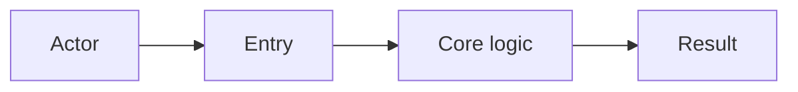

# Feature: [Name]

> Part of the project knowledge base. Hub: [AGENTS.md](../../../AGENTS.md)  
> Related: [Architecture](../../architecture.md) · [Roadmap](../../roadmap.md) · [Decisions](../../decisions/)  
> **Cold-agent readable:** a reader with no chat must recover **intent**, **success criteria**, **non-goals**, and **next actions** from this file alone. No “as we discussed”. Dual reading → gap. See [modes.md §19](modes.md#19-cold-agent-readable).

**Status:** Real | Dual | Local | Demo | Partial | Planned | In progress | Shipped | Deprecated | Unknown  
*(See [status-taxonomy.md](status-taxonomy.md). Primary token required; optional note in parentheses.)*  
**Slug:** `feature-slug`  
**Owners:** [team or roles]  
**Last updated:** YYYY-MM-DD

## Purpose

[One paragraph: what problem this feature solves and for whom.]

## Canonical authority

| Topic | Authority (link) | This pack's role |
|-------|------------------|------------------|
| Business rules | e.g. `docs/modules/….md` | Entry + gaps only |
| Invariants | e.g. `docs/canonical/….md` | Link |
| Ops rules | hub / CLAUDE.md | Do not restate |

If an authority already exists, **do not re-narrate it**. Keep Purpose, Public surface, Open questions, and links.

## Users & success

- **Primary users:** …
- **Success metrics:** …
- **Out of scope:** …

## Acceptance criteria

- [ ] …
- [ ] …

## Public surface

| Kind | Surface | Notes |
|------|---------|-------|
| API / route | | |
| UI | | |
| CLI / job | | |
| Events | | |
| ModuleId | | |

## How it works

[Short explanation. Link to code entry points. Prefer links to module docs over long prose.]

### Flow

## Dependencies

- **Depends on:** …
- **Depended on by:** …
- **External services:** …

## Design decisions

- Link ADRs here (existing productive paths preferred), e.g. [ADR-00N](../../decisions/ADR-00N-....md)
- Or summarize minor choices that do not deserve an ADR

## Edge cases & risks

- …
- …

## Open questions

- …

## Next actions

- [ ] …   # first concrete step a cold agent can take; not chat leftovers

## Implementation bridge

> Optional Stage B when the pack is still incomplete and the user opts into placement/stubs.  
> Rules: [implementation-bridge.md](implementation-bridge.md). Do not list unreal APIs as Real.

**Stubs written:** no | yes (user opt-in)

| Area | Proposed path | Layer | Status |
|------|---------------|-------|--------|
| Gap fill | TBD | TBD | hypothesis |

## Related docs

- Plan (if promoted): [../../plans/<slug>/README.md](../../plans/<slug>/README.md)
- Design detail: [design.md](./design.md) (if present)
- Requirements: [requirements.md](./requirements.md) (if present)
