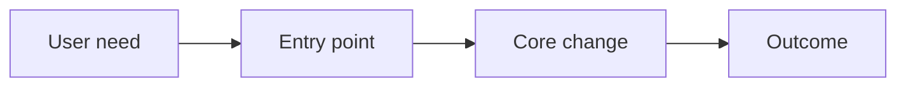

# Plan: [Name]

> **Plan (not SSOT implementation docs).** New writes live at `docs/plans/<github-login>/<slug>/` ([modes.md §20](modes.md#20-plans-layout)).  
> Hub: [AGENTS.md](../../../../AGENTS.md)  
> Related: [Roadmap](../../../roadmap.md) · [Architecture](../../../architecture.md) · future pack: `docs/features/<slug>/`  
> When this ships or lands in code, **promote** to a feature pack (see Promotion), then **archive-on-finish**.  
> **Cold-agent readable:** a reader with no chat must recover **intent**, **success criteria**, **non-goals**, and **next actions** from this file alone. No “as we discussed”. Dual reading → gap. See [modes.md §19](modes.md#19-cold-agent-readable).  
> **Pstack bake (always-on):** subtract-before-add; attack the premise when scope is fuzzy or prior fixes failed; falsifiable acceptance (prove-it predicates); next actions independently verifiable; one-way doors need ≥2 structurally distinct approaches (Open questions / Approach or HITL); experience/outcome first. Live `/architect` / `/figure-it-out` only via HITL when pstack is present — [modes.md §22](modes.md#22-pstack-plan-bridge).  
> Adjust `../` counts if this plan still lives on an adopted flat `docs/plans/<slug>/` path (do not force-migrate).

**Status:** Planned | In progress | Shipped | Cancelled | Superseded  
**Slug:** `feature-slug`  
**Kind:** new feature | epic | spike | redesign  
**Owners:** [team or roles]  
**Last updated:** YYYY-MM-DD  
**Code path (if any):** `…` or *none yet*

## Problem

[What hurts today? Who feels it? Why now?]

## Outcome

[One paragraph: what success looks like for users/business after this lands. Experience/outcome first — not implementation convenience.]

## Users & success

- **Primary users:** …
- **Success metrics:** …
- **Non-goals / out of scope:** …   # subtract-before-add: what NOT to build
- **Delete first:** …               # optional; what to remove before adding

## MVP scope

| In MVP | Later / out |
|--------|-------------|
| … | … |

## Acceptance criteria

Write as **falsifiable prove-it predicates** a cold agent can check. Not vibes.

- [ ] …
- [ ] …
- [ ] …

## Proposed public surface (hypothesis)

| Kind | Surface | Notes |
|------|---------|-------|
| API / route | | TBD until code |
| UI | | |
| CLI / job | | |
| Events | | |
| ModuleId / package | | |

*If code does not exist yet, mark rows TBD — do not invent endpoints.*

## Approach (short)

[How we think we will build it. Link architecture constraints. Prefer bullets over essays.]
On a **one-way door**, list at least two **structurally distinct** approaches here or under Open questions (or HITL). Whole-shape alternatives, not point tweaks.

## Dependencies & risks

- **Depends on:** …
- **Blocked by:** …
- **Risks:** …
- **Open decisions:** (promote to ADR only when locked)

## Open questions

- …   # attack the premise when scope is fuzzy or prior fixes failed; one-way doors → ≥2 approaches

## Next actions

Independently verifiable units (each can be proven without the others).

- [ ] …   # first concrete step a cold agent can take; not chat leftovers

## Implementation bridge

> **Opt-in Stage B.** Omit this section until the user asks to implement / scaffold / stubs — or leave a one-line placeholder: *“Say implement/stubs to fill.”*  
> Full rules: [implementation-bridge.md](implementation-bridge.md). Paths below are **hypotheses**, not SSOT.

**Stubs written:** no | yes (user opt-in)

### Placement

| Area | Proposed path | Layer (Ark or convention) | Status |
|------|---------------|---------------------------|--------|
| Entry | TBD | TBD | hypothesis |
| Core | TBD | TBD | hypothesis |
| Tests | TBD | TBD | hypothesis |

### Engineering checklist

- [ ] (derive from Acceptance criteria)
- [ ]

### Stub inventory (only if user opted in)

| Path | Purpose | Written? |
|------|---------|----------|
| | | no |

### Anti-hallucination

- No endpoint/table/ModuleId marked **Real** without code evidence.

## Promotion

When implementation starts or the surface is real in code:

1. Create `docs/features/<slug>/` from [feature-readme-template.md](feature-readme-template.md) (status from **code**, not stubs).
2. Re-check acceptance criteria against code; supersede diverged stub inventory.
3. Move durable decisions into ADRs if locked.
4. Link this plan from the feature pack (**Related docs**).
5. Mark this plan **Shipped** or **Superseded** and link the feature pack.
6. **Archive-on-finish** ([modes.md §20](modes.md#20-plans-layout)): move this whole slug folder to `docs/plans/<github-login>/_archive/<slug>/` when possible; update hub nav + Surface coverage. Stub at the old path only if links would break and HITL says keep.

See also promote checklist in [implementation-bridge.md](implementation-bridge.md).

## Related

- Roadmap row / epic: …
- ADR (if any): …
- Spike / research: …
